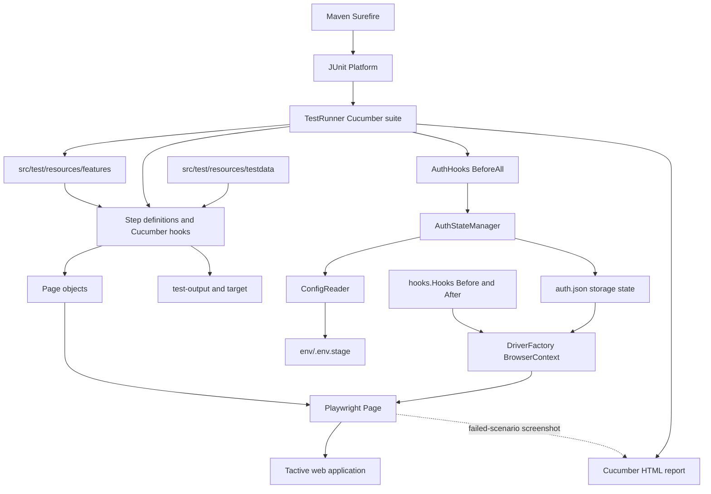
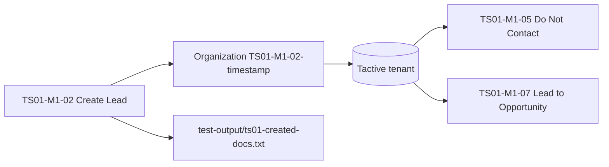
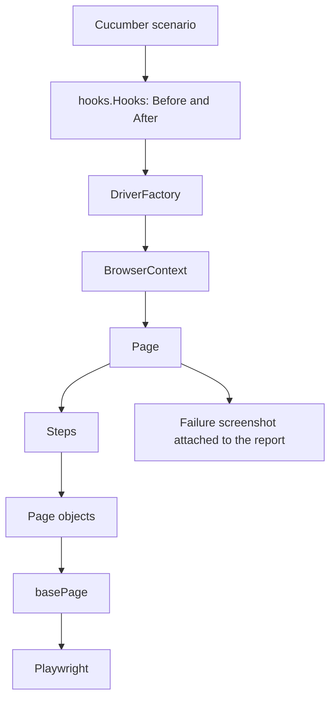

# Test Automation Architecture

Location: `docs/architecture.md`
Related docs: [`execution-strategy.md`](execution-strategy.md), [`test-data-strategy.md`](test-data-strategy.md), [`locator-strategy.md`](locator-strategy.md)

---

## 1. Overview

This repository is a Java-based UI automation suite for the Tactive web application (a Frappe / ERPNext tenant). Maven compiles the test code and launches a JUnit Platform suite. Cucumber executes the Gherkin scenarios and Playwright for Java drives Chromium.

The codebase is test-framework focused: `src/main/java/com/tactive/App.java` is a placeholder console application, not an application-under-test entrypoint.

### Current coverage

| Module | Area | Status |
| --- | --- | --- |
| **M1** | Business development / lead tracking | Complete |
| **M2** | Project estimation | Foundation in place (`TS01-M2-01` done), remaining scenarios planned for later |
| **M3** | Procurement, inventory and execution | Planned for later (the `Buying` feature folder is ready) |
| **M4** | Accounts | Foundation in place (`TS01-M4-01` done), remaining scenarios planned for later |

Scenario IDs follow the pattern `TS01-M<module>-<nn>`. The full scenario map and commands are in [`execution-strategy.md`](execution-strategy.md).

---

## 2. Architecture at a Glance



---

## 3. Components and Responsibilities

| Component | Responsibility |
| --- | --- |
| `pom.xml` | Declares Playwright, Cucumber, JUnit 5, dotenv, compiler release 25 and Surefire. |
| `runners/TestRunner.java` | Defines the JUnit Platform Cucumber suite, selects the `features` classpath resource, registers step-definition and hook glue, and writes `target/cucumber-reports/cucumber.html`. |
| `stepDefinitions/` | Maps Gherkin steps to browser actions and assertions, grouped by workflow: login, leads/opportunities, invoicing and projects. |
| `pages/` | Page objects that hold locators and reusable UI actions for login, leads/opportunities, invoicing and projects. Each receives a Playwright `Page`. |
| `baseLocator/basePage.java` | Shared locator/helper base, created and ready for adoption. Workflow page objects currently hold their own locators and can extend it as common Frappe helpers emerge. `baseTest.java` is reserved for shared test setup. |
| `factory/DriverFactory.java` | Owns thread-local Playwright, browser, context and page instances. Selects Chromium, Firefox or WebKit by name (scenarios currently request Chromium). Loads `auth.json` unless the scenario is tagged `@freshLogin`. |
| `hooks/` | `AuthHooks` prepares authentication once per suite. `Hooks` owns the scenario browser lifecycle and takes failed-scenario screenshots through `DriverFactory`. The package is registered as Cucumber glue. |
| `utils/AuthStateManager.java` | Performs a headless Chromium login when `auth.json` is missing and saves the storage state for later contexts. |
| `utils/config/ConfigReader.java` | Loads `env/.env.stage` and exposes the base URL (`getBaseUrl()`) and credentials through `get(key)`. |
| `src/test/resources/features/` | Feature files for login, invoicing, lead CRUD, project CRUD and the sample upload. |
| `src/test/resources/testdata/` | Upload inputs under `uploads/`; `downloads/` is reserved for downloaded files. |
| `docs/` | Project documentation: architecture, execution strategy, test-data strategy and locator strategy. |

---

## 4. Layering Conventions

The suite keeps each layer focused on one job.

| Layer | Owns | Example |
| --- | --- | --- |
| **Feature file** | Business behaviour, scenario data values and tags | `TS01-M1-05 Set Status to Do Not Contact` |
| **Step definition** | Orchestration between scenario intent and page-object calls, plus the explicit verification steps | `leadCRUD.java` |
| **Page object** | Locators (one method each) and reusable UI actions | `leadPage.java`, `LoginTactivePage.java` |
| **Factory / hooks** | Browser, context and page lifecycle, authentication state | `DriverFactory`, `Hooks`, `AuthHooks` |
| **Config** | Environment values and credentials | `ConfigReader`, `env/.env.stage` |

Locator conventions are described in [`locator-strategy.md`](locator-strategy.md).

---

## 5. Lead Workflow (Module 1)

Module 1 is the reference implementation for the pattern the other modules will follow.

### 5.1 Page objects

- **`LoginTactivePage`**: `enterUserName()`, `enterPassword()` (both read from `ConfigReader`), `clickLoginButton()` and `loggedInConfirmation()`.
- **`leadPage`** (`com.tactive.pages.LeadsOppertunity`), organised in labelled groups:

| Group | Members |
| --- | --- |
| Existing | `addLeadButton()`, `seriesSelect()`, `statusSelect()` |
| Form fields | `firstNameInput()`, `organizationNameInput()`, `emailInput()`, `saveButton()` |
| List page | `leadListTitles()`, `leadInList(title)` |
| M1-03 mandatory validation | `modalContent()`, `msgPrint()`, `dialogCloseButton()`, `firstNameMandatoryLabel()` |
| M1-05 status change | `listRow(org)`, `openLeadList()`, `leadFromList(name)`, `openLeadFromList(name)`, `changeStatusAndSave(status)`, `getListStatusFor(org)` |

`leadInList` returns the locator immediately. `leadFromList` waits up to 15 seconds and raises a clear "lead was not found in the list" message, so scenarios fail with a readable reason.

### 5.2 Step definitions

`stepDefinitions/LeadsOppertunity/leadCRUD.java` groups steps by scenario:

| Scenario | What the steps cover |
| --- | --- |
| `TS01-M1-01` | Open Add Lead and assert the default Series and Status |
| `TS01-M1-02` | Fill the form with unique data, save, verify the save, record the document ID, confirm the lead appears in the list |
| `TS01-M1-03` | Save without First Name, read the mandatory-fields dialog, close it, verify the mandatory asterisk |
| `TS01-M1-04` | Reuse the dialog capture to verify the invalid-email message and that the lead was not saved |
| `TS01-M1-05` | Open the lead from the list, change status to "Do Not Contact", save, verify the list shows the new status |
| `TS01-M1-06` | Covered by the list check in `TS01-M1-02`: the created lead is found in the list |

### 5.3 Patterns worth reusing in later modules

- **Frappe form state as the save signal.** Saves are verified through the form state (`cur_frm`: no longer new, no unsaved changes) instead of the URL. This works for any Frappe DocType.
- **Unique data per run.** The organization, first name and email get a timestamp plus a random suffix, which keeps parallel and repeated runs from colliding.
- **Per-scenario state.** Cucumber creates one step-class instance per scenario, so fields such as `lastCreatedOrganization`, `lastCreatedDocId` and `dialogsMandate` are naturally isolated.
- **Diagnostics on failure.** When a save cannot be confirmed, the step captures a full-page screenshot to `target/screenshots/` and reports the form state (name, local flag, dirty flag, status indicator).
- **Guarded shared output.** Created document IDs are appended to `test-output/ts01-created-docs.txt` behind a lock (`<doc id> | <organization>`).
- **Soft signals versus real checks.** The "Saved" toast is a soft signal that is logged; the form-state check is the authoritative assertion.

### 5.4 Data flow between scenarios



`TS01-M1-05` receives the organization name from the feature file, so it reuses the lead created by M1-02 instead of creating a new one. Details are in [`test-data-strategy.md`](test-data-strategy.md).

---

## 6. Tag Strategy (summary)

| Group | Tags | Purpose |
| --- | --- | --- |
| Scenario ID | `@TS01-M1-01` ... `@TS01-M4-05` | Run one scenario |
| Module | `@M1` ... `@M4` | Run a module |
| Suite | `@smoke`, `@local-only` | Separate CI-safe checks from local-only runs |
| Data | `@createData` | Scenario writes `TS01-` records to the tenant |
| Setup | `@tactiveLogin`, `@freshLogin` | Login state handling |
| Type | `@validation` | Negative and mandatory-field checks |

Example run (PowerShell, note the quotes around the whole argument):

```powershell
mvn clean test "-Dcucumber.filter.tags=@TS01-M1-05"
```

The full command catalogue is in [`execution-strategy.md`](execution-strategy.md).

---

## 7. Scenario Lifecycle

1. Surefire discovers the JUnit suite and starts the Cucumber engine.
2. Cucumber loads feature files from `src/test/resources/features` and uses glue from `com.tactive.stepDefinitions` and `com.tactive.hooks`.
3. `AuthHooks.ensureAuthenticated()` runs once before scenarios. If `auth.json` does not exist, `AuthStateManager` reads `env/.env.stage`, logs in and creates the storage-state file.
4. For each scenario, `hooks.Hooks` initialises `DriverFactory`. The `@freshLogin` tag requests a new context without loading saved storage state; other scenarios reuse `auth.json` when present.
5. Step definitions get the factory's `Page` and pass it to the workflow page objects.
6. When a scenario fails, `Hooks` attaches a screenshot taken from the same page to the report, then closes the browser.
7. Cucumber writes the HTML report under `target/cucumber-reports/`.

---

## 8. Data and Artifacts

| Artifact | Location | Notes |
| --- | --- | --- |
| Environment values and credentials | `env/.env.stage` | Environment-specific; keep real credentials out of version control. |
| Browser storage state | `auth.json` | Sensitive, short-lived test output. |
| Cucumber report | `target/cucumber-reports/cucumber.html` | Rebuilt on each run. |
| Failure screenshots | `target/screenshots/` | Created when a lead save cannot be confirmed. |
| Created document IDs | `test-output/ts01-created-docs.txt` | Basis for cleanup of `TS01-` data. |
| Upload inputs | `src/test/resources/testdata/uploads/sample_dataset.csv` | Used by the upload feature. |

`mvn clean` clears `target/`; `test-output/` is kept between builds.

---

## 9. Refinement Roadmap

The suite runs end to end today. These are the next steps that will make it easier to scale across Modules 2 to 4.

| Area | Where we are | Next step |
| --- | --- | --- |
| **Module 1** | Complete, with the list check covered inside M1-02 | Use it as the reference for later modules |
| **Single browser lifecycle** | Done: `hooks.Hooks` owns the scenario browser through `DriverFactory` and takes failure screenshots from the same page | Keep this as the standard for new scenarios (see 9.1) |
| **Authoritative assertions** | Lead steps assert on form state and fail the scenario when it is unmet. The invoicing and project success steps currently log their outcome | Move those checks to assertions, following the lead pattern |
| **Clean-login scenarios** | `@freshLogin` skips loading storage state | Let suite-level auth setup skip `@freshLogin` runs, so a clean-login test never depends on a pre-generated `auth.json` |
| **Parallel execution** | `DriverFactory` is thread-local and lead data is unique per run | Add Cucumber parallel configuration once hook state and output files are isolated per scenario |
| **Base page adoption** | `basePage` is created and ready to use | Have workflow page objects extend it as common actions emerge (waits, list search, save-and-verify) |
| **Upload feature** | The sample upload feature and its data file are ready | Add the matching step-definition class |
| **Modules 2 to 4** | `TS01-M2-01` and `TS01-M4-01` are in place, and the scenario plan and tags are defined | Reuse the Module 1 patterns: page object per DocType, one step class per module, `TS01-` data, drafts only |

### 9.1 Browser lifecycle

Each scenario runs on one browser. `hooks.Hooks` creates it through `DriverFactory`, and both the steps and the failure screenshot use that same page. This replaced an earlier legacy hook that started a second Chromium just to take screenshots.



What this gives the suite:

- The screenshot shows the exact page state at the point of failure.
- One browser per scenario, so runs start faster and use less memory.
- Cleanup happens in one place, which also suits parallel execution.
- The screenshot is attached to the Cucumber report next to the failed scenario.

`basePage` is created and ready. The page objects will sit on top of it as shared Frappe helpers are consolidated (see [`locator-strategy.md`](locator-strategy.md)).

---

## 10. Ownership Guidelines

- Feature files describe business behaviour and carry tags. Browser mechanics stay out of them.
- Step definitions orchestrate: they call page-object operations and hold the explicit verification steps.
- Page objects own locators and reusable UI actions, one locator per method.
- One component owns the browser lifecycle for a scenario.
- Authentication mode is explicit per scenario (`auth.json` reuse by default, `@freshLogin` for a clean login).
- Scenario data is prefixed `TS01-`, made unique per run, and CI never submits documents.
- Parallel runs are switched on after per-scenario isolation of browser state, hooks, output files and tenant data.
