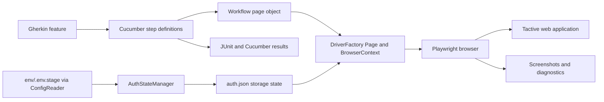
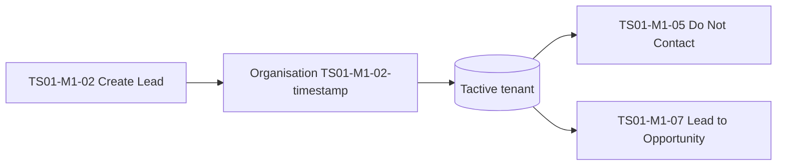

# Test Automation Strategy

Location: `docs/test-automation-strategy.md`
Related docs: [`architecture.md`](architecture.md), [`execution-strategy.md`](execution-strategy.md), [`test-data-strategy.md`](test-data-strategy.md), [`locator-strategy.md`](locator-strategy.md)

---

## 1. Purpose

This strategy describes how the Playwright Java suite validates high-value Tactive workflows with clear, repeatable and reviewable results. It builds on the repository's Java 25, Maven, JUnit Platform, Cucumber and Playwright stack.

The strategy aims to:

- Verify user-visible business outcomes across the core Tactive workflows.
- Keep scenario intent readable for business, QA and engineering stakeholders.
- Make environment, authentication, browser and test-data behaviour explicit.
- Produce actionable run evidence through Cucumber reports and diagnostic artifacts.
- Grow workflow and browser coverage module by module, using patterns that are already proven.

---

## 2. Coverage Portfolio

Scenarios are organised around user journeys and business capabilities, and numbered by module: `TS01-M<module>-<nn>`.

### 2.1 Feature areas

| Capability | Scenario focus | Feature location |
| --- | --- | --- |
| Login and session | Credential-based login and saved-session access | `features/LoginTactive.feature` |
| Leads and opportunities | Lead defaults, creation, validation, list visibility, status changes, Lead to Opportunity | `features/LeadsOppertunity/` |
| Projects and quotations | Project form and project creation | `features/Projects/` |
| Invoicing and accounting | Invoicing workspace navigation and Sales Invoice visibility | `features/Invoicing/` |
| Procurement | Material Request and Purchase Order flows | `features/Buying/` (ready for the M3 scenarios) |
| Data import | Upload workflow using a CSV fixture | `features/sampleUpload/` |

### 2.2 Module plan

| Module | Business area | Scenarios | Status |
| --- | --- | --- | --- |
| **M1** | Business development / lead tracking | `TS01-M1-01` to `TS01-M1-07` | Complete |
| **M2** | Project estimation | `TS01-M2-01` to `TS01-M2-06` | Foundation in place (`TS01-M2-01` done). `TS01-M2-02` to `TS01-M2-06` planned for later |
| **M3** | Procurement, inventory and execution | `TS01-M3-01` to `TS01-M3-05` | Planned for later |
| **M4** | Accounts | `TS01-M4-01` to `TS01-M4-05` | Foundation in place (`TS01-M4-01` done). `TS01-M4-02` to `TS01-M4-05` planned for later |

Module 1 covers the full lead flow. The first scenarios in Module 2 and Module 4 establish the project and invoicing flows, and the remaining scenarios follow the same patterns when they are picked up.

### 2.3 Module 1 scenarios

| ID | Scenario | Status |
| --- | --- | --- |
| `TS01-M1-01` | Open New Lead, assert Series and Status defaults | Done |
| `TS01-M1-02` | Create Lead (happy path), appears in the list | Done |
| `TS01-M1-03` | Save without First Name, mandatory validation | Done |
| `TS01-M1-04` | Invalid email is not accepted | Done |
| `TS01-M1-05` | Set Status to Do Not Contact | Done |
| `TS01-M1-06` | Filter the list by `TS01-`, the lead is returned | Covered in `TS01-M1-02` (list check after creation) |
| `TS01-M1-07` | Lead to Opportunity | Done |

### 2.4 Foundation scenarios in other modules

| ID | Scenario | Status |
| --- | --- | --- |
| `TS01-M2-01` | New Project details: Project Name `TS01-EST-001`, Status Open, Company Cloud ERP (Demo), save succeeds | Done |
| `TS01-M4-01` | Invoicing smoke: open `/desk/invoicing`, Sales Invoice links are visible | Done |

### 2.5 Coverage principles

- Smoke coverage protects critical navigation and business outcomes.
- Focused validation scenarios cover required fields, invalid values and workflow-specific rules.
- Each scenario centres on one observable behaviour, so results are easy to read and ownership is clear.

---

## 3. Framework and Design



| Layer | Role |
| --- | --- |
| **Feature files** | Express business intent in Gherkin, with scenario IDs and tags for focused selection. |
| **Step definitions** | Coordinate actions and hold the explicit verification steps. |
| **Page objects** | Own workflow-specific locators and reusable UI operations, and receive the active Playwright `Page`. |
| **DriverFactory** | Shared boundary for browser, context and page ownership. Chromium is the standard browser, and Firefox and WebKit are available for targeted coverage. |
| **JUnit Platform and Cucumber** | Suite discovery, execution, tag filtering and reporting through Maven Surefire. |

### 3.1 Scenario design standard

1. Give every scenario a unique ID in the `@TS01-M<module>-<nn>` format.
2. Use descriptive scenario names and Given/When/Then steps that show setup, action and observable outcome.
3. Keep reusable locators and UI mechanics in page objects, and scenario intent in the feature and step layers.
4. Verify a meaningful postcondition, such as a saved record appearing in a list or a validation message being shown.
5. Use explicit Playwright visibility or state checks with bounded timeouts for asynchronous UI behaviour.
6. Keep scenario state and generated data isolated, so scenarios can be selected and repeated independently.

### 3.2 Proven patterns from Module 1

Module 1 is the reference implementation for later modules.

- **Form state as the save signal.** Frappe saves are confirmed through the form state (the document is no longer new and has no unsaved changes) rather than the URL, so the same check works for any DocType.
- **Confirm in the list.** After a save, scenarios confirm the result in the list view, for example the lead row showing its new status.
- **Readable failures.** Waiting helpers such as `leadFromList` return the locator and raise a clear "not found in the list" message.
- **Visible diagnostics.** When a save cannot be confirmed, the step captures a screenshot and the form state.
- **Single-locator page objects.** Each locator is its own method, grouped by purpose (form fields, list page, validation), which keeps steps short and reusable.

---

## 4. Authentication and Environment

`ConfigReader` loads the base URL and credentials from `env/.env.stage`. `AuthStateManager` can perform a headless Chromium login and save the browser storage state to `auth.json`, and `DriverFactory` loads that state for authenticated scenarios.

| Tag | Session behaviour |
| --- | --- |
| `@tactiveLogin` | Login flow that produces or refreshes the saved session |
| `@freshLogin` | Clean context for scenarios that exercise the login form |
| `@loginStorage` | Workflows that use the saved authenticated session |

Operating principles:

- Environment URLs and credentials live outside feature files and Java source, and the base URL comes from `ConfigReader.getBaseUrl()`.
- `auth.json` is temporary run state. It is refreshed through the established login flow when needed.
- The session mode of each scenario is explicit through its tags.
- One scenario-scoped owner creates and closes the browser, context and page, and the failure evidence comes from that active page.

---

## 5. Test Data and Isolation

Stable input fixtures live in `src/test/resources/testdata/`, for example `uploads/sample_dataset.csv`.

- **Prefix.** Records created in the shared Tactive tenant start with `TS01-`.
- **Unique suffix.** Creating scenarios add a timestamp and random suffix, so repeated and parallel runs stay distinguishable.
- **Data creation.** Scenarios that write to the tenant carry `@createData`, and execution is classified with `@smoke`, `@ci` and `@local-only`.
- **Document IDs.** Generated lead document IDs are appended to `test-output/ts01-created-docs.txt`, which gives a ready list for locating and cleaning up records.
- **Reuse across scenarios.** Dependent scenarios reuse records created earlier. For example, `TS01-M1-05` works on the lead created by `TS01-M1-02`, with the organisation name passed from the feature file.
- **Fixtures versus artifacts.** Input fixtures are version-controlled. Downloaded files, screenshots, browser state and reports are run artifacts.



Full details are in [`test-data-strategy.md`](test-data-strategy.md).

---

## 6. Execution Profiles

The tag taxonomy selects the right scope for each situation.

| Profile | Tags | Intent |
| --- | --- | --- |
| Scenario | `@TS01-Mx-nn` | Run one scenario |
| Module | `@M1` to `@M4` | Run a business area |
| Smoke / CI | `@smoke`, `@ci` | Fast, safe, critical-path checks for routine CI feedback |
| Validation | `@validation` | Business-rule and form-validation checks |
| Data creation | `@createData` | Scenarios that write to the tenant, run against the designated test environment |
| Login | `@tactiveLogin`, `@freshLogin`, `@loginStorage` | Login and session behaviour |

CI safety rules:

- CI runs the smoke set and never submits documents. Sales Invoices, Journal Entries and similar records are saved as drafts only.
- Scenarios that write data are tagged `@createData` and `@local-only`, and run on demand.

Example (PowerShell, with the whole `-D` argument in quotes):

```powershell
mvn clean test "-Dcucumber.filter.tags=@TS01-M1-05"
```

The full command catalogue and current scenario mapping are in [`execution-strategy.md`](execution-strategy.md).

---

## 7. Assertions, Evidence and Reporting

Scenario status reflects verified business outcomes.

- Playwright assertions verify visible UI state, form values, validation messages and persisted results.
- Waits are tied to an expected state, with a clear assertion message where it helps diagnosis.
- Soft signals, such as the "Saved" toast, are logged, while the form-state check is the authoritative assertion.

Reports and evidence:

| Output | Location |
| --- | --- |
| Test run results | Maven Surefire and the Cucumber JUnit Platform engine |
| HTML report | `target/cucumber-reports/cucumber.html` |
| Screenshots and diagnostics | `target/screenshots/` |
| Created lead document IDs | `test-output/ts01-created-docs.txt` |

Failure evidence is taken from the page used by the scenario and tied to that scenario and run.

---

## 8. Browser and Concurrency Growth

- **Baseline.** Chromium is the stable baseline for CI and local development.
- **Cross-browser.** Firefox and WebKit are added for workflows where browser compatibility is a requirement, through the browser selection in `DriverFactory` and a deliberate browser matrix.
- **Parallel execution.** `DriverFactory` uses thread-local browser resources, and lead data is unique per run, which gives a strong starting point. Parallel execution is introduced step by step as browser state, hook state, output files and tenant data become scenario-scoped, with repeatability and report quality confirmed at each concurrency level.
- **Dependent scenarios.** Scenarios that reuse earlier data, such as `TS01-M1-05` after `TS01-M1-02`, run after their creator.

---

## 9. Quality Governance

- Review each new scenario for business value, a unique ID tag, environment needs, data ownership and a verifiable outcome.
- Keep the smoke profile concise and predictable.
- Expand validation coverage around high-impact workflows and business rules.
- Follow the page-object and locator conventions in [`locator-strategy.md`](locator-strategy.md).
- Keep fixtures and data ownership aligned with [`test-data-strategy.md`](test-data-strategy.md).
- Use reports and evidence in release and regression decisions.

---

## 10. Next Steps

| Focus | Next step |
| --- | --- |
| Module 1 | Complete, including the list check after creation |
| Modules 2 to 4 | Build on `TS01-M2-01` and `TS01-M4-01`, and apply the Module 1 patterns when the remaining scenarios are picked up: one page object per DocType, one step class per module, `TS01-` data and drafts only |
| Smoke set | Tag the navigation and workspace checks, such as `TS01-M2-06`, `TS01-M3-05`, `TS01-M4-01` and `TS01-M4-05`, for routine CI feedback |
| Tags | Add module tags (`@M1` to `@M4`) and `@validation` to the feature files |
| Browser lifecycle | Keep a single scenario-scoped owner and take failure screenshots from the scenario's own page |
| Parallel runs | Enable when scenario-level isolation is in place |
